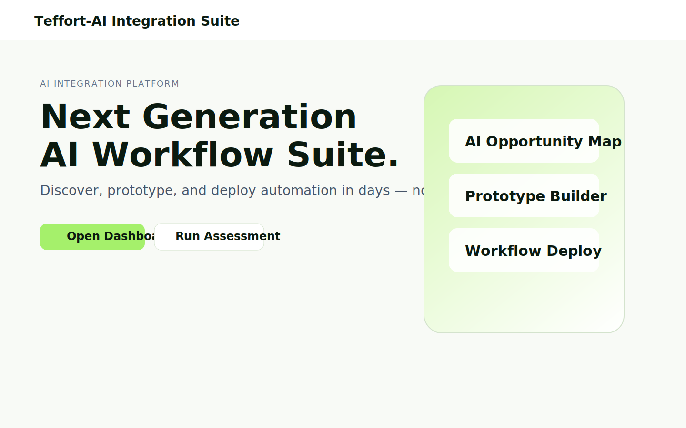
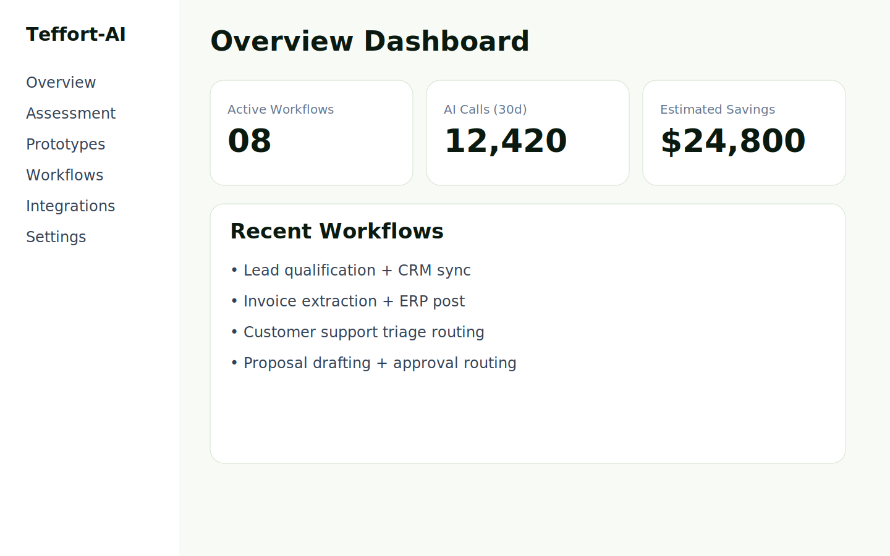

# Teffort-AI Integration Suite

Production-ready MVP SaaS platform for discovering, prototyping, and deploying AI-powered business automations.

## Tech Stack
- Next.js 15 (App Router, TypeScript)
- TailwindCSS + shadcn-style component primitives
- NextAuth (credentials demo, extensible)
- PostgreSQL + Prisma ORM
- OpenAI abstraction layer
- Vitest smoke tests

## Features
- Multi-tenant foundation: organizations, users, memberships, roles (Owner/Admin/Member)
- Dashboard with overview metrics, AI usage visibility, recent workflows
- AI Business Assessment module (stored with opportunity map + ROI)
- AI Prototype Generator (stored output + JSON export)
- Workflow Builder MVP (trigger → AI step → action, activate/deactivate)
- Integration model with OAuth-ready schema placeholders
- Usage tracking model for billing preparation (tokens and cost)

## Folder Structure
```txt
.
├── prisma/
│   └── schema.prisma
├── src/
│   ├── app/
│   │   ├── (auth)/sign-in/page.tsx
│   │   ├── (auth)/sign-up/page.tsx
│   │   ├── api/
│   │   │   ├── assessment/route.ts
│   │   │   ├── prototypes/route.ts
│   │   │   ├── workflows/route.ts
│   │   │   ├── integrations/route.ts
│   │   │   ├── usage/route.ts
│   │   │   ├── orgs/route.ts
│   │   │   ├── ai/chat/route.ts
│   │   │   └── auth/[...nextauth]/route.ts
│   │   ├── dashboard/
│   │   │   ├── page.tsx
│   │   │   ├── assessment/page.tsx
│   │   │   ├── prototypes/page.tsx
│   │   │   ├── workflows/page.tsx
│   │   │   ├── integrations/page.tsx
│   │   │   └── settings/page.tsx
│   │   ├── globals.css
│   │   ├── layout.tsx
│   │   └── page.tsx
│   ├── components/
│   │   ├── dashboard/
│   │   ├── forms/
│   │   └── ui/
│   └── lib/
│       ├── ai/
│       ├── auth/
│       ├── db/
│       ├── rbac/
│       └── validators/
├── tests/smoke.test.ts
├── .env.example
└── README.md
```

## Environment Setup
1. Copy env:
   ```bash
   cp .env.example .env
   ```
2. Install deps:
   ```bash
   npm install
   ```
3. Generate Prisma client and migrate:
   ```bash
   npx prisma generate
   npx prisma migrate dev --name init
   ```
4. Run dev server:
   ```bash
   npm run dev
   ```

## Security Notes
- All API input validated with Zod
- Prisma parameterization prevents SQL injection
- Secrets loaded from environment variables
- Prepared for secure OAuth callback/token storage in next phase

## Scripts
- `npm run dev`
- `npm run build`
- `npm run lint`
- `npm run typecheck`
- `npm run test`

## Screenshots



